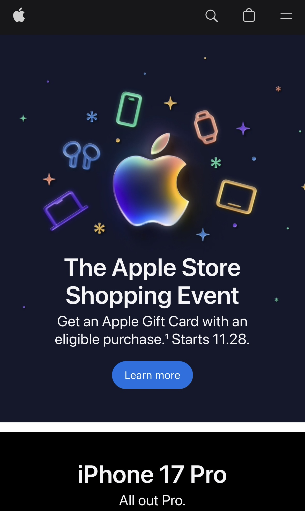
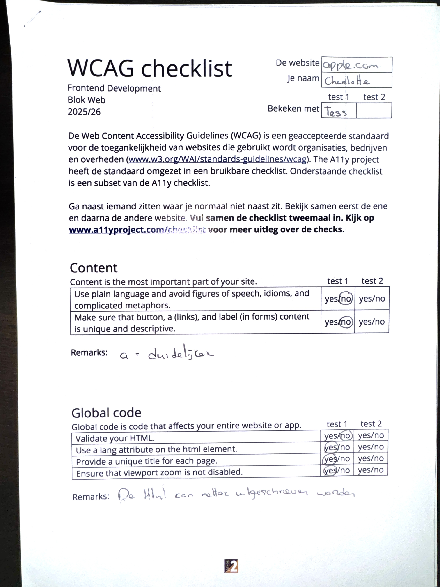
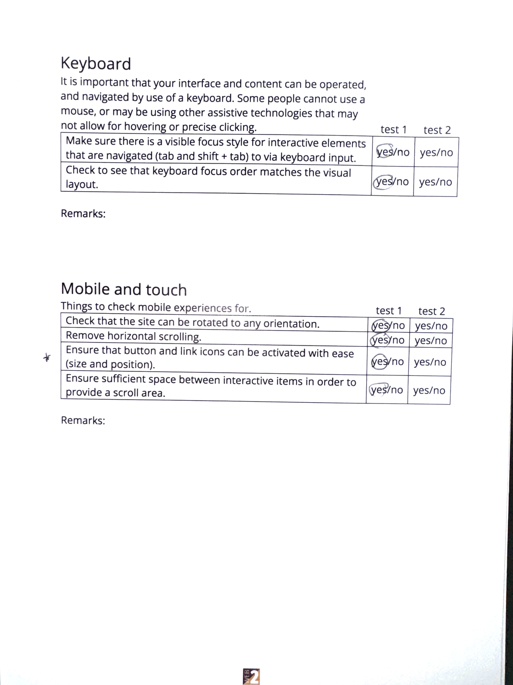
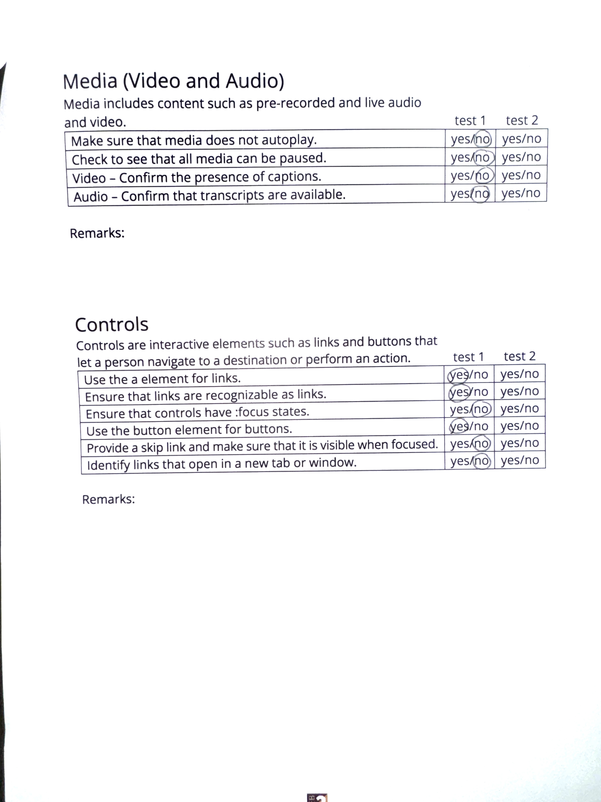
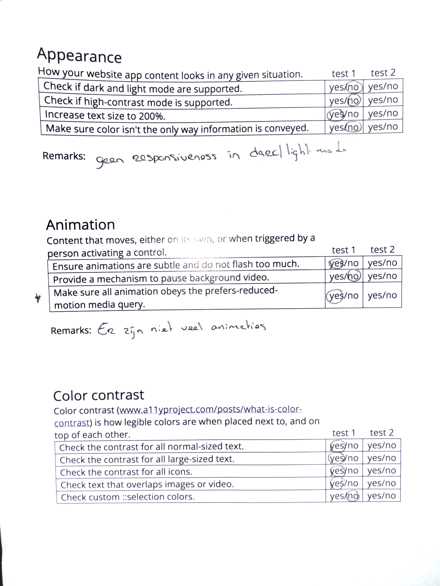
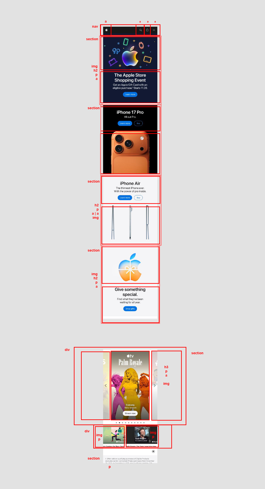
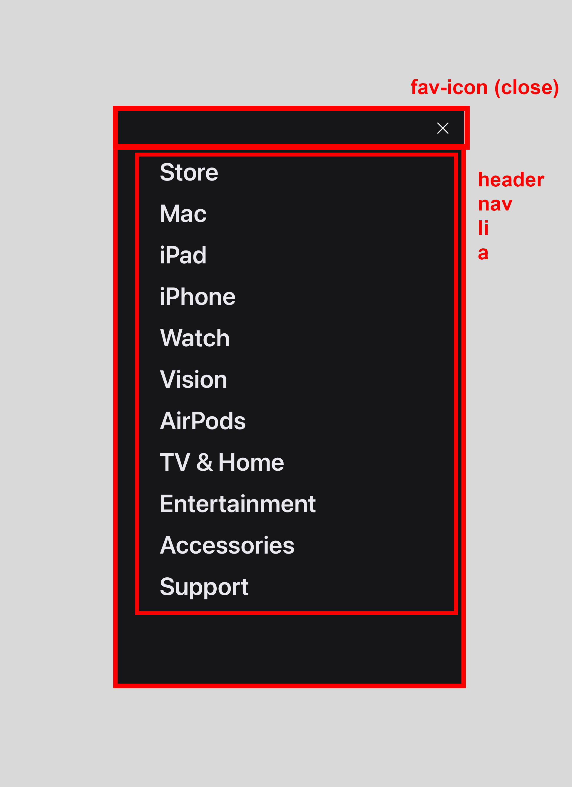

# Procesverslag
Markdown is een simpele manier om HTML te schrijven.  
Markdown cheat cheet: [Hulp bij het schrijven van Markdown](https://github.com/adam-p/markdown-here/wiki/Markdown-Cheatsheet).

Nb. De standaardstructuur en de spartaanse opmaak van de README.md zijn helemaal prima. Het gaat om de inhoud van je procesverslag. Besteedt de tijd voor pracht en praal aan je website.

Nb. Door *open* toe te voegen aan een *details* element kun je deze standaard open zetten. Fijn om dat steeds voor de relevante stuk(ken) te doen.

## Jij

  
uitwerken voor kick-off werkgroep

  ### Auteur:
  Charlotte Moolenaar

  #### Je startniveau:
  Rood / Zwart

  #### Je focus:
  Surface plane (als er nog tijd is Responsive)
 

## Je website

  
uitwerken voor kick-off werkgroep

  ### Je opdracht:
  link naar website: Osmo.supply of apple.com

  #### Screenshot(s) van de eerste pagina (small screen): 
  Homepagina Apple
  
  

  #### Screenshot(s) van de tweede pagina (small screen):
  Productpagina Iphones Apple 
  
  
 

## Toegankelijkheidstest 1/2 (week 1)

  
uitwerken na test in 2e werkgroep

  ### Bevindingen
  Tijdens de toegankelijkheidstest op de Apple-website kwamen een aantal bevindingen naar voren:

  - De HTML bevatte veel onduidelijke klassen en was niet volledig gevalideerd, wat de leesbaarheid van de code vermindert.
  - De structuur van de koppen (zoals H2 en H3) zou duidelijker en consistenter kunnen worden toegepast om de inhoud logischer te maken.
  - Lijstitems in de navigatie waren onduidelijk of ontbraken volledig, wat de semantiek en toegankelijkheid beïnvloedt.
  - Toegankelijkheid van afbeeldingen: Hoewel afbeeldingen werden beschreven met behulp van <aria-label>, ontbrak vaak alt-tekst, wat essentieel is voor schermlezers.
  - De site bevat weinig animaties. Dit biedt ruimte om de gebruikerservaring te verbeteren met creatieve maar toegankelijke animaties.
  - Voordat de gebruiker de hoofdinhoud bereikt, moet hij eerst de hele navigatie doorlopen (desktop). Hierdoor is het onduidelijk waar de pagina over gaat.
  - Knoppen zoals ‘Meer informatie’ zijn niet erg specifiek, waardoor het voor gebruikers moeilijk kan zijn om precies te begrijpen wat ze kunnen verwachten.
  - De website reageerde niet op de licht en donkere modus (systeem instellingen), wat de toegankelijkheid en consistentie beperkte.

  ## Test 1 Document

  
  
  
  
  
  

## Breakdownschets (week 1)

  
uitwerken na afloop 3e werkgroep

  ### de hele pagina: 
  

  ### dynamisch deel - menu: 
  

  ### wellicht nog een dynamisch deel (bijv filter): 
  

## Voortgang 1 (week 2)

  
uitwerken voor 1e voortgang

  ### Stand van zaken
  Vanwege afwezigheid door griep moet ik nog een paar onderdelen doornemen, met name het gedeelte over de JS 3-stap. Na de voortgangsgesprek zal ik de HTML-pagina maken en publiceren op Github, aangezien ik hier pas later achter kwam dat we daar moesten aan beginnen. Ik begrijp wat er op de pagina moet komen te staan.

  ### Agenda voor meeting
  samen met je groepje opstellen

| Vragen die ik wil stellen        |
| ---              |
| Ik was er tijdens de laatste werkgroepen niet. Is er nog wat belangrijks gezegd over wat er met de website moet gebeuren? |
| Ik ben van website veranderd en heb voor apple.com gekozen. |

  ### Verslag van meeting
  Na het gesprek heb ik kort de belangrijkste resultaten samengevat:

  Tijdens de vergadering heb ik mijn vragen kunnen stellen. Er werd aangegeven dat de HTML-structuur en de schetsen voor de indeling uiterlijk volgende week klaar moeten zijn, omdat we dan met   het CSS-gedeelte beginnen. Daarnaast moeten we bij het eindresultaat minstens drie specifieke JavaScript-regels in ons project moeten toepassen (later heb ik deze werkgroep doorgenomen).  

Ik heb ook duidelijk gemaakt dat ik mijn gekozen website had gewijzigd in apple.com. Verder heb ik goed geluisterd naar de input van anderen. Hun vragen en uitleg over hun HTML-structuur gaven me meer inzicht in hoe ik mijn eigen structuur op een logische en duidelijke manier kan opzetten.

## Voortgang 2 (week 3)

  
uitwerken voor 2e voortgang

  ### Stand van zaken
  De opbouw van mijn HTML verliep goed. Ik had van tevoren een duidelijk idee hoe ik de structuur wilde aanpakken, zodat deze overzichtelijk en toegankelijk zou zijn (met duidelijke kopjes en een logische volgorde).

  ### Agenda voor meeting
  samen met je groepje opstellen

 | Vragen      |
 | ---              |
| Bij de opbouw van een section die helemaal klikbaar is, zou dat een list item en a zijn met daarin de elementen. |
  | Is de :root duidelijk genoeg qua naamgeving voor de kleuren. |
  | Mag ik een div gebruiken om twee elementen (a) naast elkaar te zetten met display flex? |

  ### Verslag van meeting
  Een punt waar ik op vastliep, was het naast elkaar plaatsen van twee <a> elementen. Ik vroeg me af of dit mogelijk was met een 
 en display: flex (omdat dit een makkelijke manier is), ik kreeg daar al snel te horen dat er een andere manier, zelf denk ik om display: grid te gebruiken. Verder verliepen de werkgroepen deze week goed, maar ik realiseer me dat ik in het volgende deel, CSS, echt gefocust moet blijven en goed moet nadenken over hoe ik verschillende elementen ga aanpakken.

## Toegankelijkheidstest 2/2 (week 4)

  
uitwerken na test in 9e werkgroep

  ### Bevindingen
  Lijst met je bevindingen die in de test naar voren kwamen (geef ook aan wat er verbeterd is):

## Voortgang 3 (week 4)

  
uitwerken voor 3e voortgang

  ### Stand van zaken
  hier dit ging goed & dit was lastig (neem ook screenshots op van delen van je website en code)

  ### Agenda voor meeting
  samen met je groepje opstellen

  | student 1      | student 2          | student 3    | student 4        |
  | ---            | ---                | ---          | ---              |
  | dit bespreken  | en dit             | en ik dit    | Wat is het beste voor de H1? De visually hidden class of h1, a, img |
  | en dat ook nog | dit als er tijd is | nog een punt |                  |
  | ...            | ...                | ...          |                  |

  ### Verslag van meeting
  hier na afloop snel de uitkomsten van de meeting vastleggen

  - punt 1
  - punt 2
  - nog een punt
  - ...

## Eindgesprek (week 5)

  
uitwerken voor eindgesprek

  ### Je uitkomst - karakteristiek screenshots:
  

  ### Dit ging goed/Heb ik geleerd: 
  Korte omschrijving met plaatjes

  

  ### Dit was lastig/Is niet gelukt:
  Korte omschrijving met plaatjes

  

## Bronnenlijst

  
continu bijhouden terwijl je werkt

  Nb. Wees specifiek ('css-tricks' als bron is bijv. niet specifiek genoeg). 
  Nb. ChatGpT en andere AI horen er ook bij.
  Nb. Vermeld de bronnen ook in je code.

  1. bron 1
  2. bron 2
  3. ...

